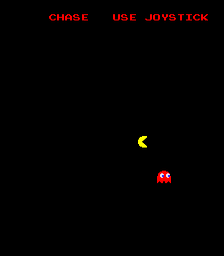

# Galaxian BASIC

**Write games for classic arcade hardware using BASIC!**

Galaxian BASIC is a retro programming language designed for **Galaxian / Scramble** and **Namco Pac-Man** arcade hardware. Write simple BASIC programs that compile to C, then to Z80 machine code, and run on real arcade hardware or MAME.

## Why Galaxian BASIC?

- **Authentic retro experience** — Your programs run on actual 1980s arcade hardware (or MAME)
- **Simple BASIC syntax** — Easy to learn, with built-in commands for sprites, scrolling, sound, and input
- **No bytecode interpreter** — Compiles BASIC → C → Z80 for native execution
- **Modern tooling** — Web IDE (`make ide`) with graphics and palette editors; emulator/debugger still planned

## What's Working Now

The Z80 runtime is complete and running in MAME! The **BASIC → C → Z80 → ROM** pipeline works:

- **gbasic.py** — Compiles BASIC to C with full command set:
  - Integer literals: decimal; C-style hex `0xNN`; BASIC-style hex `NNH` / `NNh` (digits `0-9A-F`, must start with a digit, e.g. `0FFh`, `10FFH`)
  - Display: CLS, PRINT, POKE, COLOR, SCROLL, PUTSHAPE (2×2 tile blocks)
  - Sprites: SPRITE, HIDE, MISSILE (hardware missile layer)
  - Control: LET, IF/THEN/ELSE/ENDIF, FOR/NEXT, GOTO, WAIT
  - Input: JOY(n), INPUT(n)
- **SDCC** — Compiles generated C to native Z80 machine code
- **Runtime engine** — Text, sprites, missiles, scrolling, watchdog
- **Pipeline** — `make PROGRAM=examples/hello.bas` produces a runnable ROM (no bytecode interpreter)
- **renum.py** — Renumber .bas files and update GOTO targets
- **Namco Pac-Man** — Same BASIC → C → Z80 pipeline with `TARGET=pacman`; CPU ROM only, stock tile/sprite ROMs. See [README_PACMAN.md](README_PACMAN.md).


**Next up:** Sound on hardware, richer debugger, AI helper.

**Web IDE:** Code editor, help reference, graphics editor, palette editor. Run `make ide` and open http://localhost:8080

See [README_GRAPHICS.md](README_GRAPHICS.md) for details on the unified `.gfx.json` format.

## Quick Start

Want to see it in action? Build and run the demo:

```bash
cd galaxian-basic
make          # Build the ROM (default demo)
make run      # Launch in MAME
```

**Default build** compiles `examples/demo.bas` (bouncing sprites + scrolling):

```bash
make          # BASIC demo → ROM
make run      # Launch in MAME
```

**Other BASIC programs:**

```bash
make PROGRAM=examples/hello.bas
make PROGRAM=examples/sprite.bas run
make PROGRAM=examples/scroll.bas run
make PROGRAM=examples/chase.bas run   # Joystick + moving enemy
make PROGRAM=examples/example.bas run # Full demo (chars, sprites, missiles, explosion)
make PROGRAM=examples/input_test.bas  # Input/button display
make PROGRAM=examples/if_else_test.bas
make PROGRAM=                  # Build C demo (no BASIC)
```

**Renumber a BASIC file:**

```bash
python scripts/renum.py examples/example.bas -n        # Dry run (print only)
python scripts/renum.py examples/example.bas           # Renumber in place
python scripts/renum.py examples/example.bas -o out.bas --start 100 --step 10
```

**Requirements:** 
- SDCC 3.8.0 (Z80 compiler) — default path: `~/Downloads/sdcc-3.8.0`
- MAME (arcade emulator)
- Python 3

**Output files:**
- `build/galaxian-scramble-game.rom` — Complete ROM image
- `scramble/` — Individual ROM chips for MAME (s1.2d–s8.2p, c1.5h, c2.5f, etc.)

**Run manually:** `mame scramble -rompath .` (from the `galaxian-basic/` directory)

**Web IDE:**

```bash
make ide   # Serves IDE at http://localhost:8080
```

Open http://localhost:8080 for the web-based editor with:
- **Code** — BASIC editor with syntax highlighting
- **Help** — Language reference
- **Graphics** — Tile editor (64 tiles, 16×16, 2 bpp) with 8×8 char view
- **Palette** — 32-color palette editor (3-3-2 RGB) with sub-palette selector
- **Load GFX / Save GFX** — Load and save `.gfx.json` files

**Graphics workflow:** 
1. Edit tiles and palette in the IDE
2. Save to `examples/yourprogram.gfx.json`
3. Build with `make PROGRAM=examples/yourprogram.bas` (automatically uses matching `.gfx.json`)

The `.gfx.json` format is the single source of truth. See [README_GRAPHICS.md](README_GRAPHICS.md) for details.

## Example Programs

Here's what Galaxian BASIC code looks like:

**Hello World:**
```basic
10 REM Hello Galaxian
20 CLS
30 PRINT 5, 10, "HELLO"
40 PRINT 5, 12, "GALAXIAN"
50 WAIT 120
60 GOTO 20
```


**Sprite Animation:**
```basic
10 REM Sprite demo
20 CLS
30 SPRITE 0, 100, 112, 24, 1
40 PRINT 2, 0, "SPRITE"
50 WAIT 30
60 GOTO 50
```


**Scrolling Effect:**
```basic
10 REM Scrolling demo
20 CLS
25 LET S = 0
60 PRINT 8, 15, "SCROLL!"
70 WAIT 1
80 LET S = S + 1
90 FOR C = 4 TO 27
100   SCROLL C, S
110 NEXT C
200 GOTO 70
```


**Chase (joystick + AI sprite):**
```basic
10 REM Chase - joystick moves player, enemy bounces
20 CLS
30 LET PX = 100
40 LET PY = 120
50 LET PX = PX + JOY(1)
60 LET PX = PX - JOY(0)
70 LET PY = PY + JOY(3)
80 LET PY = PY - JOY(2)
90 SPRITE 0, PX, PY, 24, 1
100 SPRITE 1, EX, EY, 24, 2
110 GOTO 50
```


**Chase on Pac-Man** — `examples/chase.bas` builds for both targets. On Pac-Man the same logic drives stock maze sprites (player + ghost). Requires Pac-Man gfx ROMs in `pacman/` or your MAME rompath (see [README_PACMAN.md](README_PACMAN.md)).

```bash
make TARGET=pacman PROGRAM=examples/chase.bas run-pacman
```



See the `examples/` folder for more sample programs!

## Project Structure

```
galaxian-basic/
├── README.md       # You are here
├── PLAN.md         # Technical design document
├── Makefile        # Build system (supports PROGRAM=file.bas)
├── lib/            # Runtime library
│   ├── runtime.c   # Galaxian/Scramble hardware engine (no main)
│   ├── runtime_pacman.c  # Pac-Man (Namco) memory map + tilemap
│   ├── runtime.h   # Runtime API for compiled programs
│   ├── crt0.asm         # Z80 startup (Scramble)
│   ├── crt0_pacman.asm  # Z80 startup (Pac-Man, IM1 vblank)
│   └── default.gfx.json # Default graphics (tiles + palette)
├── src/            # Application source
│   ├── demo.c      # Default demo (when no PROGRAM=)
│   └── example.c   # Reference C implementation (matches example.bas)
├── scripts/        # Python tools
│   ├── gbasic.py   # BASIC → C compiler
│   ├── renum.py    # Renumber .bas files (updates GOTO targets)
│   ├── slice.py    # ROM splitter for MAME (Scramble)
│   ├── slice_pacman.py
│   └── hex2rom_pacman.py
├── examples/       # Sample BASIC programs
│   ├── example.bas # Full demo (chars, sprites, missiles, explosion)
│   ├── chase.bas
│   ├── demo.bas
│   ├── hello.bas
│   ├── scroll.bas
│   ├── sprite.bas
│   ├── input_test.bas
│   └── if_else_test.bas
├── pacman/         # Pac-Man ROM slices (pacman.6e–6j) + copied gfx when available
├── screenshots/    # demo.gif, chase.gif, pacchase.gif, …
└── build/          # Generated C and ROM output
    └── program.c   # Generated C from BASIC
```

## Build Commands

| Command | What it does |
|---------|--------------|
| `make` | Build the ROM |
| `make run` | Build and launch in MAME |
| `make clean` | Clean build artifacts |
| `make info` | Show ROM details and symbols |
| `make help` | Display help |

## Pac-Man hardware

The same BASIC → C → Z80 pipeline targets **Namco Pac-Man** (`mame pacman`) with `TARGET=pacman`. Only the **CPU ROMs** are rebuilt; stock `pacman.5e` / `pacman.5f` and PROMs supply tiles, sprites, and color. The runtime maps the 36×28 tile display and rotated controls to the same BASIC grid as the Scramble build. See **[README_PACMAN.md](README_PACMAN.md)** for ROM layout, VRAM tests, and build steps.

## The Hardware

Galaxian BASIC targets the original arcade hardware:

- **CPU**: Zilog Z80 @ 3.072 MHz
- **Display**: 32×32 tile grid (224×256 pixels, ~32 colors)
- **Sprites**: 8 hardware sprites with independent positioning
- **Scrolling**: Per-column vertical scrolling
- **Sound**: AY-3-8910 programmable sound generator
- **Input**: Joystick, fire buttons, coin slots

## Roadmap

**Current status:** BASIC → C → Z80 → ROM for **Scramble** and **Pac-Man**. Full command set on Galaxian runtime: display, sprites, missiles, scrolling, input (JOY, INPUT), GOSUB/RETURN, block `IF`/`ELSE`/`ENDIF`, hex literals (`0xNN`, `NNH`). Compiler optimizations (WAIT 1, labels, COLOR hoisting). `renum.py` for line renumbering. Web IDE with BASIC editor, help, tile/palette tools ([README_GRAPHICS.md](README_GRAPHICS.md)).

**Next:**
- Sound (AY on Scramble; Pac-Man audio latch — see PLAN)
- Stronger compile/runtime errors and debugging
- Deeper emulator integration in the IDE

See [PLAN.md](PLAN.md) for the technical roadmap and phase checklist.

## Contributing

This project is in active development. Check out the [PLAN.md](PLAN.md) to see what's being worked on and what's coming next.

## License

Same as parent project.
